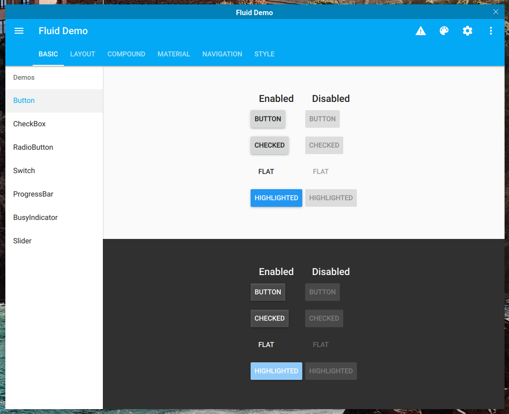

Fluid
=====

[](https://www.mozilla.org/en-US/MPL/2.0/)
[](https://github.com/lirios/fluid)
[](https://github.com/lirios/fluid/issues)
[](https://github.com/lirios/fluid/actions?query=workflow%3ACI)

Fluid is a collection of cross-platform QtQuick components for building fluid and dynamic applications,
using the [Material Design](https://material.io/guidelines/) guidelines.

Online documentation is available at [docs.liri.io](https://docs.liri.io/sdk/fluid/develop/).

We develop using the [git flow](https://danielkummer.github.io/git-flow-cheatsheet/) method
this means that the `develop` branch contains code that is being developed and might break
from time to time. If you want to check out a stable version just install one of the
releases or clone the `master` branch that has the latest released version.



## Dependencies

Qt >= 5.10.0 with at least the following modules is required:

 * [qtbase](http://code.qt.io/cgit/qt/qtbase.git)
 * [qtdeclarative](http://code.qt.io/cgit/qt/qtdeclarative.git)
 * [qtquickcontrols2](http://code.qt.io/cgit/qt/qtquickcontrols2.git)
 * [qtgraphicaleffects](http://code.qt.io/cgit/qt/qtgraphicaleffects.git)
 * [qtsvg](http://code.qt.io/cgit/qt/qtsvg.git)
 * [qtdoc](http://code.qt.io/cgit/qt/qtdoc.git)

On Linux you also need:

 * [wayland](https://gitlab.freedesktop.org/wayland/wayland) >= 1.15
 * [qtwayland](http://code.qt.io/cgit/qt/qtwayland.git)

The following modules and their dependencies are required:

 * [cmake](https://gitlab.kitware.com/cmake/cmake) >= 3.10.0

The following module must be installed, unless you want to use the copy provided
as a submodule:

 * [cmake-shared](https://github.com/lirios/cmake-shared.git) >= 1.0.0

## Build

You can perform a standalone build opening `CMakeLists.txt` with QtCreator,
but make sure `cmake` is [set up correctly](https://doc.qt.io/qtcreator/creator-project-cmake.html).

You can also build from command line:

```sh
git submodule update --init
mkdir build
cd build
cmake -DCMAKE_INSTALL_PREFIX=/path/to/prefix ..
make
make install # use sudo if necessary
```

Replace `/path/to/prefix` to your installation prefix.
Default is `/usr/local`.

You can also append the following options to the `cmake` command:

 * `-DFLUID_USE_SYSTEM_LCS:BOOL=ON`: Use a system-wide copy of LiriCMakeShared.
 * `-DFLUID_WITH_DOCUMENTATION:BOOL=OFF`: Do not build the documentation.
 * `-DFLUID_WITH_DEMO:BOOL=OFF`: Do not build the demo application.
 * `-DFLUID_WITH_QML_MODULES:BOOL=OFF`: Do not build QML modules.
 * `-DFLUID_INSTALL_ICONS:BOOL=OFF`: Embed icons into resources.

If `cmake-shared` is not installed and `-DFLUID_USE_SYSTEM_LCS:BOOL=ON` is
passed to `cmake`, the build will fail without finding `LiriSetup`.

The `cmake` arguments above can also be specified when building on QtCreator,
as explained in [this guide](https://doc.qt.io/qtcreator/creator-build-settings.html).

### Documentation

The HTML documentation is built unless `-DFLUID_WITH_DOCUMENTATION:BOOL=OFF` is
passed to cmake and it's installed into `<prefix>/share/doc/fluid/html`.

Open `<prefix>/share/doc/fluid/html/index.html` with a browser to read it.

## Installation

You can either install system-wide or per-project installation which
is essentially embedding Fluid in your project.

System-wide installations are usually performed by packagers who want
to redistribute Fluid in their Linux distro.

Per-project installation is most useful for mobile developers that
want to build Fluid alongside their project.

## System-wide installation

We assume that your distro installs QtQuick modules in `/usr/lib/qt/qml`
like `Arch Linux` does, please change the paths for your Linux distro.

The same goes for other operating systems.

From the root of the repository, run:

```sh
git submodule update --init --recursive
mkdir build
cmake -DCMAKE_INSTALL_PREFIX=/usr -DINSTALL_QMLDIR=lib/qt/qml ..
make
sudo make install
```

Please note that a system-wide installation is discouraged in most cases
because there's a risk to "pollute" your system with libraries not
managed by a package manager.

## Per-project installation

You can embed Fluid in your project and build it along your app.

We have the following examples:
We have examples for [qmake](examples/perproject/minimalqmake),
[qbs](examples/perproject/minimalqbs) and [cmake](examples/perproject/minimalcmake).

## Licensing

Licensed under the terms of the Mozilla Public License version 2.0.
